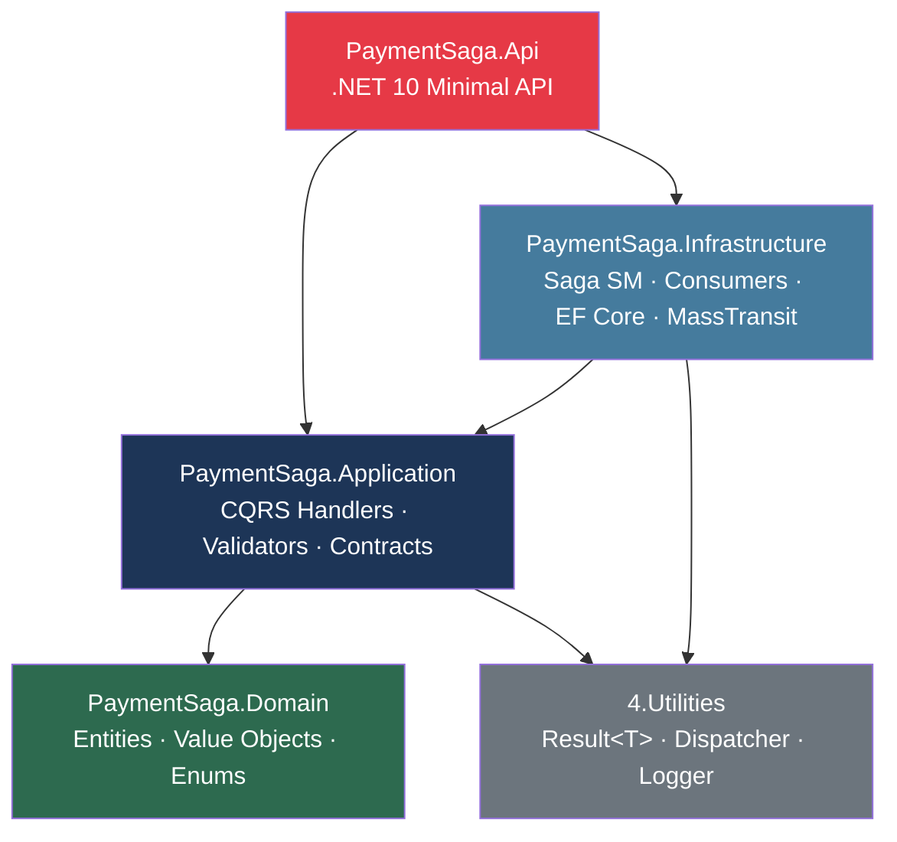
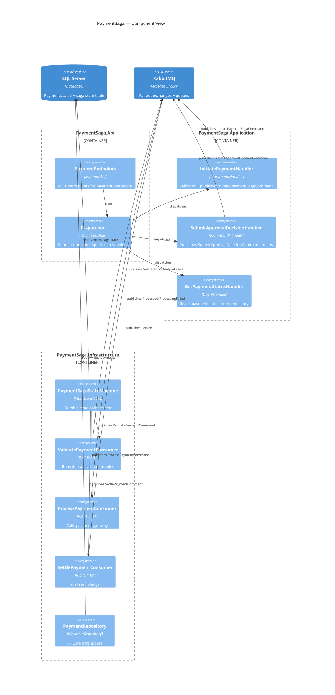
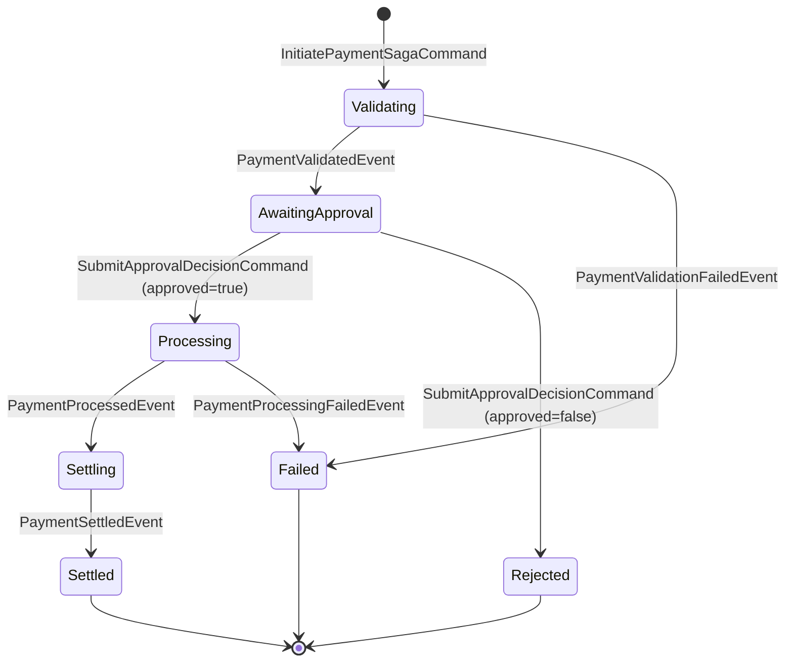
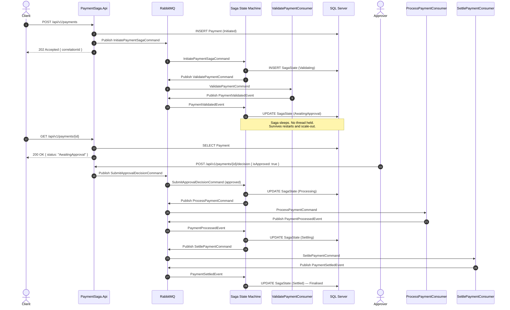
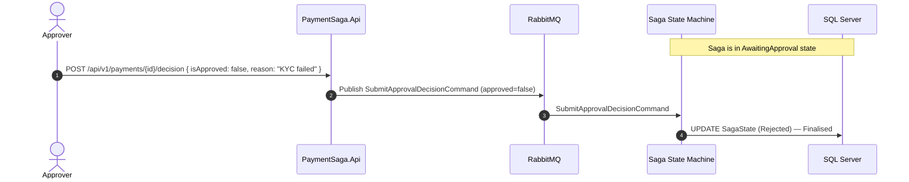
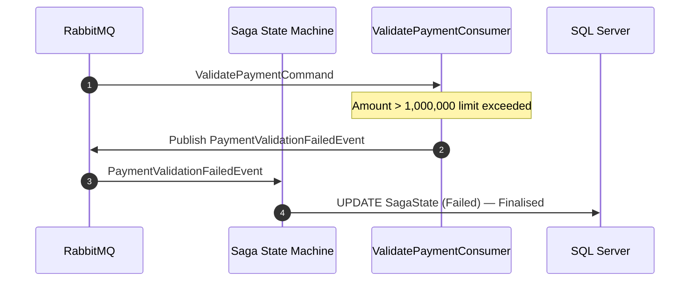
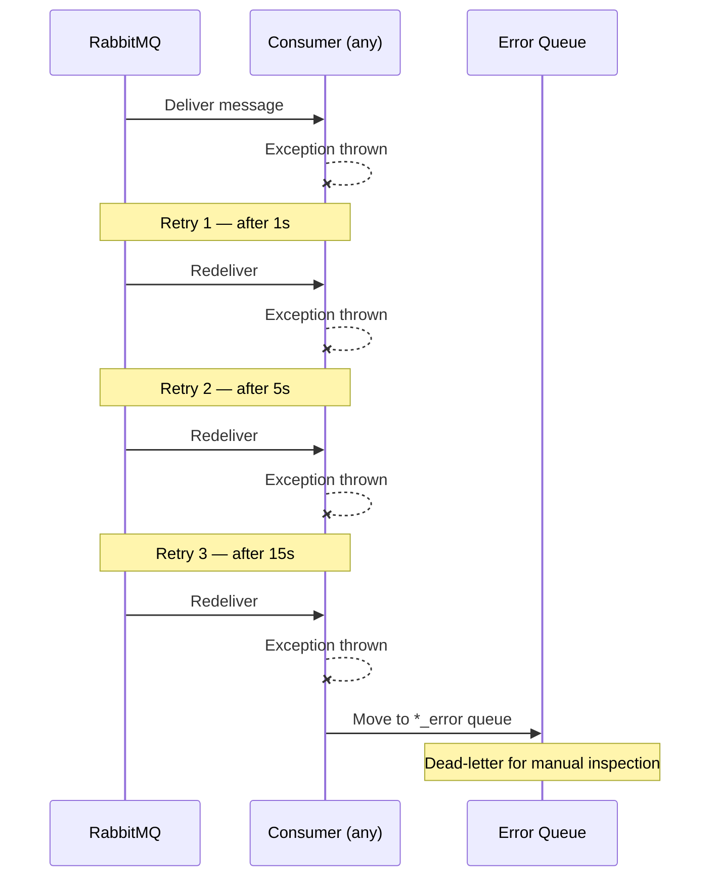
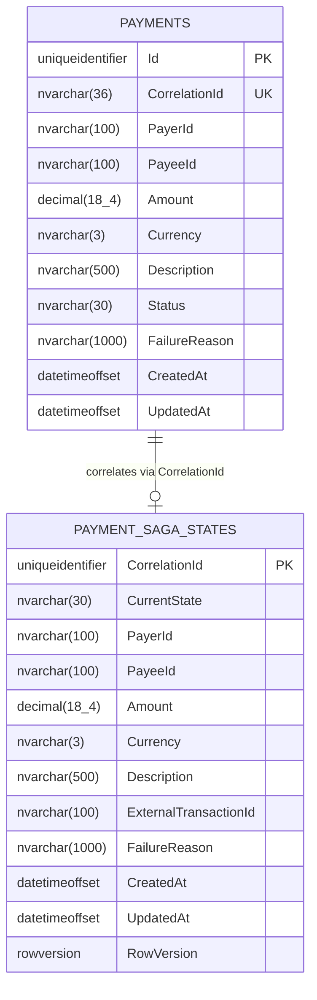
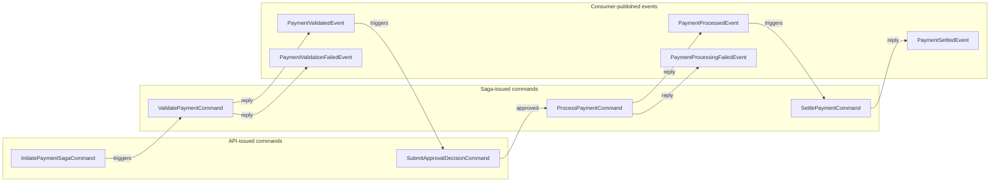

# PaymentSaga — Developer Documentation

[](https://github.com/YOUR_ORG/NET-Toolbox/actions/workflows/build.yml)
[](https://github.com/YOUR_ORG/NET-Toolbox/actions/workflows/codeql.yml)
[](https://dotnet.microsoft.com/download/dotnet/10.0)
[](https://masstransit.io)
[](https://rabbitmq.com)
[](https://learn.microsoft.com/en-us/dotnet/aspire/)
[](../../LICENSE)

---

## Table of Contents

1. [What is this?](#1-what-is-this)
2. [Why a SAGA?](#2-why-a-saga)
3. [System Analysis](#3-system-analysis)
4. [Architecture](#4-architecture)
5. [State Machine](#5-state-machine)
6. [Sequence Diagrams](#6-sequence-diagrams)
7. [Data Model](#7-data-model)
8. [Message Contracts](#8-message-contracts)
9. [Security Considerations](#9-security-considerations)
10. [Running Locally](#10-running-locally)
11. [Testing](#11-testing)

---

## 1. What is this?

**PaymentSaga** is a reference implementation of a long-running, externally-gated payment approval workflow.

The core problem it solves:

> A payment is submitted, validated automatically, then **waits for a human (or external system) to approve or reject it** before processing and settling. This wait can last minutes, hours, or days. The service must survive restarts, scale horizontally, and never lose state.

This is implemented as a **MassTransit Saga State Machine** backed by SQL Server for durable state, and RabbitMQ as the message broker. The API is .NET 10 Minimal API, orchestrated by .NET Aspire.

---

## 2. Why a SAGA?

| Concern             | Naive HTTP approach    | SAGA approach                   |
| ------------------- | ---------------------- | ------------------------------- |
| **Durability**      | State lost on restart  | Persisted in SQL Server         |
| **Scale-out**       | Sticky sessions needed | Any node handles any message    |
| **External wait**   | Polling loop in memory | State machine sleeps in DB      |
| **Partial failure** | Manual rollback code   | Compensation steps are explicit |
| **Observability**   | Custom logging         | Distributed traces via OTEL     |
| **Retry**           | Manual                 | MassTransit retry pipeline      |

---

## 3. System Analysis

### Actors

| Actor                       | Role                                                    |
| --------------------------- | ------------------------------------------------------- |
| **Client**                  | Submits payment requests via REST API                   |
| **Payment API**             | Validates input, dispatches CQRS command, reads status  |
| **Saga State Machine**      | Orchestrates the end-to-end flow, persists state        |
| **ValidatePaymentConsumer** | Runs domain validation rules                            |
| **ProcessPaymentConsumer**  | Calls external payment gateway                          |
| **SettlePaymentConsumer**   | Finalises in ledger / accounting                        |
| **Approver**                | External human or system that approves/rejects via REST |
| **RabbitMQ**                | Message broker — decouples all components               |
| **SQL Server**              | Stores payment records and saga state                   |

### Bounded Context

```
┌─────────────────────────────────────────────────────┐
│  Payment Bounded Context                            │
│                                                     │
│  ┌──────────┐    CQRS     ┌────────────────────┐   │
│  │  API     │ ──────────► │  Application Layer │   │
│  └──────────┘             └────────┬───────────┘   │
│                                    │ publishes      │
│                           ┌────────▼───────────┐   │
│                           │  MassTransit Bus   │   │
│                           └────────┬───────────┘   │
│                    ┌───────────────┼───────────┐    │
│                    ▼               ▼           ▼    │
│             ┌──────────┐  ┌──────────────┐  ┌───┐  │
│             │  Saga SM │  │  Consumers   │  │DB │  │
│             └──────────┘  └──────────────┘  └───┘  │
└─────────────────────────────────────────────────────┘
```

### Quality Attributes

| Attribute         | Mechanism                                                                 |
| ----------------- | ------------------------------------------------------------------------- |
| **Durability**    | Saga state in SQL Server with row-version optimistic concurrency          |
| **Scalability**   | Stateless API + stateless consumers; saga state is externalised           |
| **Observability** | OpenTelemetry traces (OTLP), Serilog structured logs, Aspire dashboard    |
| **Resilience**    | MassTransit retry with exponential back-off; error queue for dead-letters |
| **Security**      | Server-side `CorrelationId`, FluentValidation on all inputs, no raw SQL   |
| **Testability**   | Interfaces at every boundary, Bogus for data, NSubstitute for mocks       |

---

## 4. Architecture

### Layers (Clean Architecture)



### Dependency rule
Dependencies only point **inward**. Domain knows nothing about infrastructure. Application knows nothing about HTTP.

### Component diagram



---

## 5. State Machine

### States

| State              | Meaning                                              |
| ------------------ | ---------------------------------------------------- |
| `Initial`          | Not yet started                                      |
| `Validating`       | Domain validation running asynchronously             |
| `AwaitingApproval` | **Durable wait** — saga is persisted; no thread held |
| `Processing`       | Payment gateway call in-flight                       |
| `Settling`         | Ledger / accounting finalisation in-flight           |
| `Settled`          | Terminal success                                     |
| `Rejected`         | Terminal — declined by approver                      |
| `Failed`           | Terminal — unrecoverable error                       |

### State transition diagram



---

## 6. Sequence Diagrams

### Happy path — payment approved and settled



### Rejection path



### Validation failure path



### Retry / error queue flow



---

## 7. Data Model

### Payments table (domain record)



> `RowVersion` on saga state provides optimistic concurrency — prevents split-brain when two nodes process the same saga simultaneously.

---

## 8. Message Contracts

All contracts are immutable `record` types in `PaymentSaga.Application/Contracts/Messages.cs`.

### Flow



---

## 9. Security Considerations

| Risk                               | Mitigation                                                                        |
| ---------------------------------- | --------------------------------------------------------------------------------- |
| **Mass assignment / over-posting** | Request models are explicit `record` types — no model binding from unknown fields |
| **CorrelationId injection**        | Server always generates `CorrelationId` — client cannot set it                    |
| **SQL injection**                  | EF Core parameterised queries only — no raw SQL                                   |
| **Secrets in code**                | All connection strings / passwords come from configuration / Aspire secrets       |
| **Denial of service**              | FluentValidation rejects malformed or oversized requests before any DB/bus call   |
| **Saga replay attacks**            | MassTransit deduplicates messages by message-id                                   |
| **Dependency vulnerabilities**     | CodeQL + Dependabot weekly scans                                                  |

---

## 10. Running Locally

**Prerequisites:** Docker Desktop, .NET 10 SDK.

```bash
# From repo root
dotnet run --project 5.PaymentSaga/src/PaymentSaga.AppHost
```

Aspire provisions:
- SQL Server on `localhost:1433`
- RabbitMQ on `localhost:5672`, management UI on `localhost:15672` (guest/guest)
- Aspire dashboard on `https://localhost:15888`

### Sample requests

```bash
# Initiate a payment
curl -X POST https://localhost:5001/api/v1/payments \
  -H "Content-Type: application/json" \
  -d '{"payerId":"payer-1","payeeId":"payee-1","amount":500.00,"currency":"ZAR","description":"Invoice 42"}'

# Check status
curl https://localhost:5001/api/v1/payments/{correlationId}

# Submit approval
curl -X POST https://localhost:5001/api/v1/payments/{correlationId}/decision \
  -H "Content-Type: application/json" \
  -d '{"isApproved":true}'
```

---

## 11. Testing

```bash
dotnet test 5.PaymentSaga/PaymentSaga.slnx --configuration Release
```

| Layer            | What's tested                                     | Tools                     |
| ---------------- | ------------------------------------------------- | ------------------------- |
| **Domain**       | Value object invariants, entity state transitions | NUnit, Bogus              |
| **Application**  | Handler success/failure paths, validation         | NUnit, NSubstitute, Bogus |
| **Architecture** | Layer dependency rules (no Domain → Infra, etc.)  | NetArchTest.Rules         |

See [src/PaymentSaga.Tests/](src/PaymentSaga.Tests/) for the full test suite.
